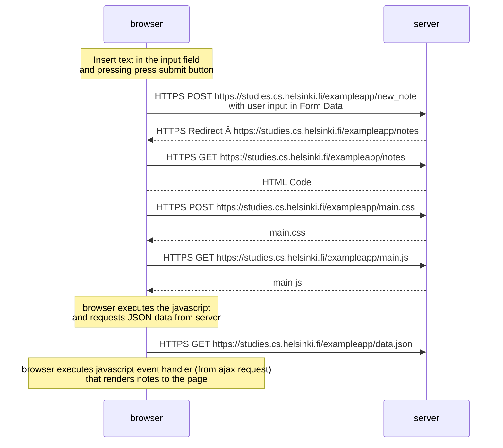

```mermaid
sequenceDiagram

	participant browser
	Note over browser: Insert text in the input field <br/>and pressing press submit button
	
	browser->>server: HTTPS POST https://studies.cs.helsinki.fi/exampleapp/new_note <br/> with user input in Form Data
	server-->>browser: HTTPS Redirect  https://studies.cs.helsinki.fi/exampleapp/notes
	browser->>server: HTTPS GET https://studies.cs.helsinki.fi/exampleapp/notes
	server-->browser: HTML Code
	browser->>server: HTTPS POST https://studies.cs.helsinki.fi/exampleapp/main.css
	server-->>browser: main.css
	browser->>server: HTTPS GET https://studies.cs.helsinki.fi/exampleapp/main.js
	server-->>browser: main.js
	
	participant browser
	Note over browser: browser executes the javascript <br/> and requests JSON data from server
	
	browser->>server: HTTPS GET https://studies.cs.helsinki.fi/exampleapp/data.json
	
	participant browser
	Note over browser: browser executes javascript event handler (from ajax request)<br/> that renders notes to the page
```