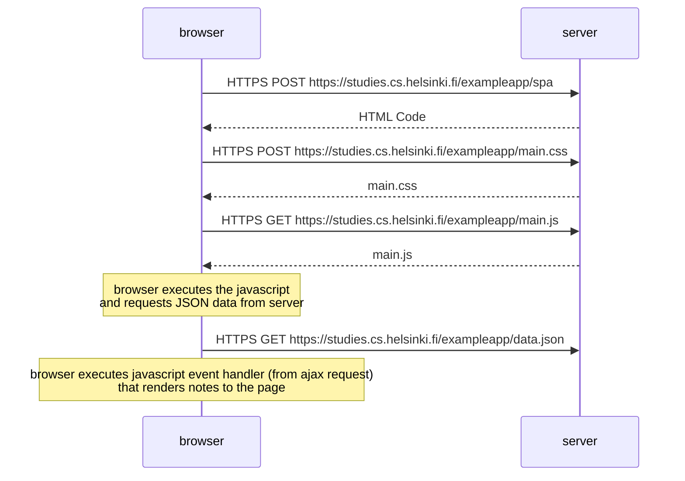

```mermaid
sequenceDiagram
	browser->>server: HTTPS POST https://studies.cs.helsinki.fi/exampleapp/spa
    server-->>browser: HTML Code
    browser->>server: HTTPS POST https://studies.cs.helsinki.fi/exampleapp/main.css
    server-->>browser: main.css
    browser->>server: HTTPS GET https://studies.cs.helsinki.fi/exampleapp/main.js
    server-->>browser: main.js

    participant browser
    Note over browser: browser executes the javascript <br/> and requests JSON data from server

    browser->>server: HTTPS GET https://studies.cs.helsinki.fi/exampleapp/data.json

    participant browser
    Note over browser: browser executes javascript event handler (from ajax request)<br/> that renders notes to the page
```